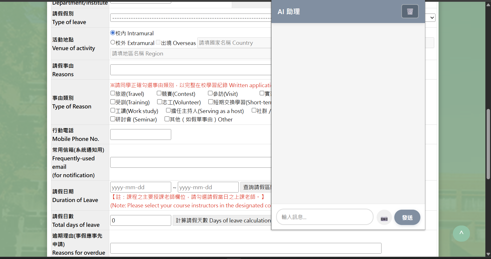
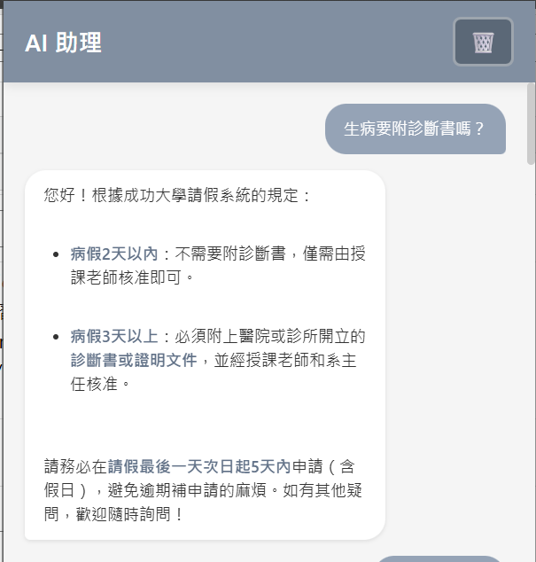
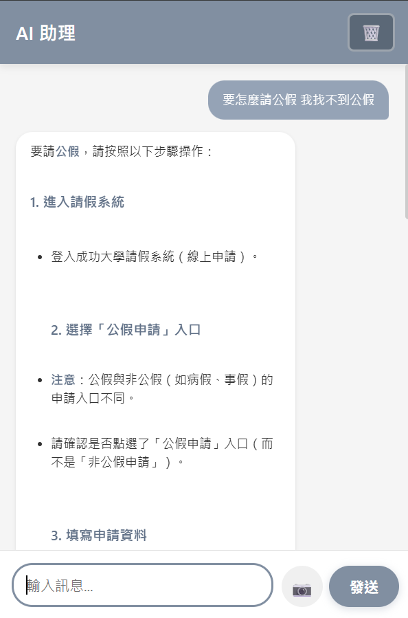
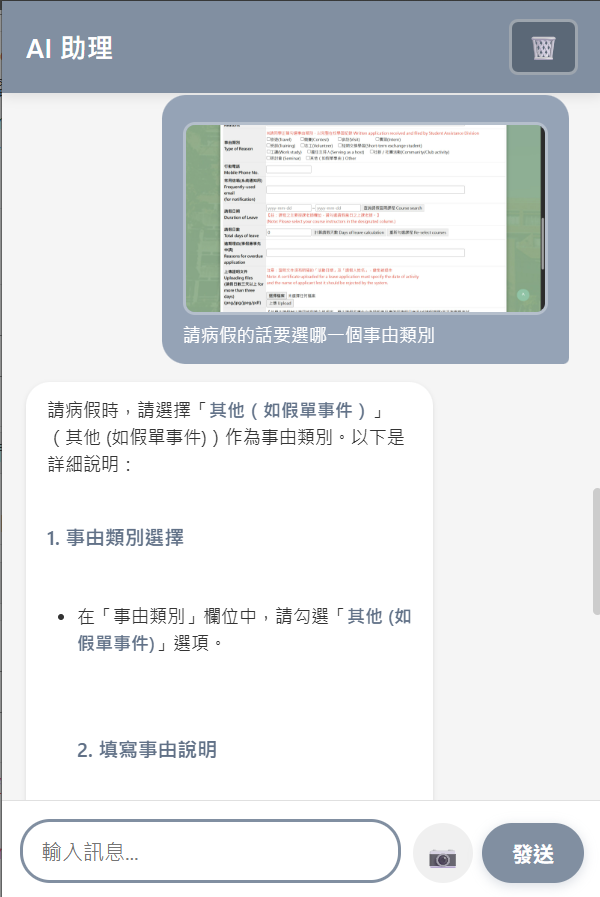

# AI Website Assistant v2

一個支援多模態對話的 Chrome Extension AI 助理，可以分析網頁截圖並回答問題。整合 RAG (Retrieval-Augmented Generation) 向量資料庫，提供基於知識庫的領域專業智能問答。

## 專案預覽

<p align="center">
  
</p>

## 🌟 專案亮點

- **模組化知識庫設計** - 透過配置文件即可快速切換不同領域的專業助理，無需修改程式碼
- **RAG 檢索增強生成** - 結合 ChromaDB 向量資料庫與 Ollama LLM，提供準確的領域專業知識
- **智能語義理解** - 內建同義詞映射與問題類型識別，理解口語化問題（如「生病」→病假）
- **多模態視覺分析** - 支援文字與圖片同時輸入，可分析網頁截圖並回答相關問題
- **自動向量管理** - 智能清理舊版本向量資料庫，保持目錄整潔

## 當前配置

- **領域：** 成功大學學生請假系統
- **知識庫：** 成大請假規則（49條文檔）
- **定位：** 可配置的領域特定智能助理（透過知識庫模組切換）

## 🛠️ 技術棧

### 前端
- **Chrome Extension** (Manifest V3)
- **JavaScript** (ES6+)
- **HTML5 / CSS3**

### 後端
- **FastAPI** - 高效能 Python Web 框架
- **Ollama** - 本地/遠端 LLM 服務
- **ChromaDB** - 向量資料庫
- **Sentence Transformers** - 多語言 Embedding 模型

### AI/ML
- **RAG (Retrieval-Augmented Generation)** - 檢索增強生成
- **Mistral devstral-small-2** - 多模態視覺語言模型
- **paraphrase-multilingual-MiniLM-L12-v2** - 中文語義 Embedding
- **語義搜尋與智能重排序**

## 📐 系統架構

```
┌─────────────┐
│    User     │
└──────┬──────┘
       │ Text + Image
       ↓
┌─────────────────────┐
│ Chrome Extension    │
│ (popup.js)          │
└──────┬──────────────┘
       │ HTTP POST
       ↓
┌─────────────────────┐
│ FastAPI Backend     │
│ (main.py)           │
└──────┬──────────────┘
       │
       ↓
┌─────────────────────┐
│ LLM Handler         │
│ (llm_handler.py)    │
└──────┬──────────────┘
       │
       ├─────────────────────────┐
       ↓                         ↓
┌───────────────────┐    ┌────────────────┐
│ Knowledge         │    │ Ollama LLM     │
│ Base (RAG)        │    │ (devstral)     │
│                   │    │                │
│ - Synonym Map     │    │ - Multimodal   │
│ - Semantic Search │    │ - Image Vision │
│ - Top-3 Retrieval │    │                │
└──────┬────────────┘    └────────┬───────┘
       │                          │
       ↓                          │
┌──────────────┐                  │
│ ChromaDB     │                  │
│ Vector Store │                  │
└──────────────┘                  │
       │                          │
       └─────────────┬────────────┘
                     ↓
              ┌──────────────┐
              │ Final Answer │
              └──────────────┘
```

## 專案結構

```
website assistant v2/
├── frontend/          # Chrome Extension 前端
├── api/              # FastAPI 後端服務
└── LLM/              # LangChain LLM 實作
    ├── config.json            # 知識庫配置（可切換領域）
    ├── knowledge_base.py      # 向量資料庫管理器
    ├── llm_handler.py         # LLM 處理器（整合 RAG）
    └── knowledge_bases/       # 模組化知識庫
        └── ncku_leave_system/ # 成大請假系統知識庫
            ├── system_rules.txt   # 系統提示詞
            ├── qa_knowledge.json  # 知識庫（49條文檔）
            └── vectordb/          # ChromaDB 向量資料庫（自動生成）
```

## 功能特色

✅ 聊天式對話介面  
✅ 網頁截圖功能  
✅ 多模態支援（文字 + 圖片）  
✅ 對話記憶（保留 2-3 輪）  
✅ 歷史記錄持久化  
✅ 網頁重整自動清除記錄  
✅ RAG 知識檢索 - 基於向量資料庫的智能問答  
✅ 口語化理解 - 支援同義詞和自然語言提問  

## 💡 使用案例

### 案例 1：口語化問題理解

**使用者輸入：**
```
生病要附診斷書嗎？
```

**系統處理流程：**
1. 同義詞擴展：「生病」→「病假」
2. 向量搜尋：找到相關的病假證明規則
3. RAG 檢索：注入 top-3 相關文檔到 prompt
4. LLM 生成回答

**AI 回應：**
```
根據成功大學請假系統的規定：

- 病假2天以內：不需要附診斷書，僅需由授課老師核准即可。

- 病假3天以上：必須附上醫院或診所開立的診斷書或證明文件，並經授課老師和系主任核准。
```
<p align="center">
  
</p>

### 案例 2：界面問題處理

**使用者輸入：**
```
我找不到公假
```

**系統處理流程：**
1. 識別 UI 關鍵字：「找不到」
2. 跳過類別過濾，搜尋假單類型選擇相關文檔
3. 返回界面操作指引

**AI 回應：**
```
如果在請假系統中找不到「公假」選項，請確認以下事項：

假單類型選擇：
- 「公假」屬於公假申請類別，請確保您已點選「公假申請」入口，而非「非公假申請」。
- 兩種假單類型在畫面上不容易分辨，請仔細檢查。

申請資格：
- 公假通常用於公務或特定法定事由（如選舉、兵役等），請確認您的請假原因是否符合規定。

如果仍然找不到，請聯繫學務處或您的系辦公室確認申請資格。
```
<p align="center">
  
</p>

### 案例 3：多模態圖片分析

**使用者操作：**
1. 點擊 📷 截圖按鈕，截取請假系統畫面
2. 輸入問題：「這個畫面要怎麼填寫？」

**AI 回應：**
```
這是成功大學請假系統的申請表單，以下是各欄位的填寫指南：

1. 請假類別
選擇您的請假類型（如「病假」、「事假」、「公假」等）。
注意：公假與非公假的申請入口不同，請確認是否點選了正確的類別。

2. 活動地點
校內：請假活動在校園內進行。
校外：請假活動在校園外進行。
出國：請假活動涉及出國。
地區名稱：若選擇校外或出國，請填寫地區或國家名稱。

3. 請假事由
請詳細說明請假原因（例如「生病就醫」、「參加比賽」、「實習」等）。

4. 事由類別
選擇最符合您請假原因的類別（例如「旅遊」、「比賽」、「實習」等）。
如果沒有符合的選項，請勾選「其他」並說明。

5. 行動電話
填寫您的手機號碼，以便聯繫。

6. 常用信箱
填寫您常用的電子信箱，用於接收請假通知。

7. 請假日期
選擇請假的起迄日期（格式：yyyy-mm-dd）。
系統會自動計算請假天數，但請確認是否有誤。

8. 請假天數
系統會自動計算請假天數，但您可以手動調整。
如果課程選擇錯誤，請點選「重新選擇課程」重新設定。

9. 逾期理由
僅逾期補申請時需要填寫，請說明為何延遲申請（例如「健康因素」、「系統問題」等）。

其他注意事項
證明文件：若請假3天以上，請上傳相關證明（如診斷書、比賽證明等）。
老師核准：請假單需由授課老師核准，請確保所有相關課程都選對。

如果有任何疑問，歡迎隨時詢問！
```
<p align="center">
  
</p>

## 安裝步驟

### 1. 後端設置

#### 安裝依賴
```powershell
# 安裝 API 依賴
cd api
pip install -r requirements.txt

# 安裝 LLM 依賴（包含向量資料庫）
cd ..\LLM
pip install -r requirements.txt
```

#### 配置環境變數
```powershell
cd LLM
copy .env.example .env
```

編輯 `.env` 文件，配置 Ollama 連接：
```
OLLAMA_BASE_URL=http://localhost:11434
OLLAMA_MODEL=qwen2.5:7b
TEMPERATURE=0.7
MAX_TOKENS=1000
```

#### 初始化向量資料庫（首次使用）
```powershell
python knowledge_base.py
```

這會：
- 載入 `knowledge_bases/ncku_leave_system/qa_knowledge.json` (49條知識文檔)
- 建立向量索引（使用 `paraphrase-multilingual-MiniLM-L12-v2`）
- 儲存到 `knowledge_bases/ncku_leave_system/vectordb/`
- 執行測試搜尋

### 2. 啟動後端服務

```powershell
cd ..\api
python main.py
```

服務將運行在 `http://localhost:8000`

### 3. 安裝 Chrome Extension

1. 打開 Chrome 瀏覽器
2. 進入 `chrome://extensions/`
3. 開啟右上角的「開發人員模式」
4. 點擊「載入未封裝項目」
5. 選擇 `frontend` 資料夾
6. 完成！Extension 圖標會出現在瀏覽器工具列

## 使用方法

### 基本對話
1. 點擊瀏覽器工具列的 Extension 圖標
2. 在輸入框輸入問題
3. 點擊「發送」按鈕
4. AI 會回應你的問題

### 截圖分析
1. 點擊 📷 截圖按鈕
2. 系統會截取當前網頁畫面
3. 輸入你想問的問題（或直接發送）
4. 點擊「發送」按鈕
5. AI 會分析截圖並回答

### 歷史記錄
- 對話記錄會自動保存
- 關閉 popup 不會清除記錄
- 重新整理網頁會自動清除該分頁的記錄
- 可手動點擊 🗑️ 按鈕清除記錄

## 技術架構

### 前端 (Chrome Extension)
- **manifest.json**: Extension 配置
- **popup.html/css/js**: 對話介面
- **background.js**: 背景服務（處理截圖）
- **content.js**: 內容腳本（注入網頁）

### 後端 (FastAPI)
- **main.py**: API 主服務
- **models/chat.py**: 數據模型
- 支援 CORS 跨域請求
- 健康檢查端點

### LLM (Ollama + RAG)
- **llm_handler.py**: LLM 處理邏輯（整合 RAG）
- **knowledge_base.py**: 向量資料庫管理器
- **config.json**: 知識庫配置（可切換不同領域）
- **knowledge_bases/**: 模組化知識庫目錄
  - **ncku_leave_system/**（當前配置）
    - `system_rules.txt`: 系統提示詞
    - `qa_knowledge.json`: 知識文檔（49條）
    - `vectordb/`: ChromaDB 向量資料庫
- 支援 Ollama 本地/遠端模型
- RAG 檢索：自動搜尋 top-3 相關知識
- 智慧重排序：同義詞映射、問題類型識別

## RAG 工作流程

```
用戶問題
    ↓
同義詞擴展（生病→病假、生理期→生理假）
    ↓
向量化 (embedding)
    ↓
ChromaDB 相似度搜尋 + 智慧重排序
    ↓
取 top-3 最相關文檔
    ↓
注入到 system prompt
    ↓
LLM 生成回答（基於檢索到的知識）
```

### 支援的口語化問法
- "生病要附診斷書嗎" → 自動匹配病假規則
- "生理期可以請假嗎" → 自動匹配生理假規則
- "找不到公假選項" → 返回假單類型選擇指引
- "感冒請假要證明嗎" → 匹配病假證明規則

## API 端點

### `POST /api/chat`
發送聊天訊息

**請求體:**
```json
{
  "message": "你好",
  "image": "base64_encoded_image",
  "history": [...]
}
```

**回應:**
```json
{
  "response": "AI 的回應",
  "status": "success"
}
```

### `GET /health`
健康檢查

### `POST /api/clear_history`
清除對話歷史

## 支援的 Ollama 模型

### 當前使用
- **devstral-small-2** - Mistral 小型視覺模型（支援圖片分析，`.env` 中設定）

### 可用模型列表

**多模態模型（支援圖片分析）：**
- `devstral-small-2` - Mistral 小型視覺模型（當前使用）
- `qwen2.5vl:7b` - Qwen2.5 Vision Language Model，推薦用於圖片分析（6.0 GB）
- `llava:7b` - 快速視覺理解模型（4.7 GB）
- `llava:13b` - 高精度視覺模型（8.0 GB）
- `moondream:1.8b` - 極快速小型視覺模型（1.7 GB）

**純文字模型（更快速度）：**
- `qwen2.5:7b` - Qwen2.5 純文字模型（4.7 GB）
- `mistral:7b` - Mistral 基礎模型
- `llama3.2:3b` - 輕量快速模型

**注意：** 遠端 Ollama 使用 GPU 加速，速度比本地 CPU 快很多。詳細模型資訊請參考 `LLM/models_config.json`。

## 開發說明

### 修改 LLM 模型
編輯 `LLM/.env`:
```
OLLAMA_MODEL=qwen2.5:7b
```

### 更新知識庫
1. 編輯 `LLM/knowledge_bases/ncku_leave_system/qa_knowledge.json`
2. 執行 `python knowledge_base.py` 重建向量索引

### 修改 System Prompt
編輯 `LLM/knowledge_bases/ncku_leave_system/system_rules.txt`

### 切換知識庫領域
編輯 `LLM/config.json`，修改 `current_knowledge_base` 欄位即可切換到不同領域的知識庫

## 知識庫擴展指南

### 如何新增新的領域知識庫

本專案採用模組化知識庫架構，可以輕鬆切換不同領域的助理功能。

#### 步驟 1：建立新的知識庫目錄

在 `LLM/knowledge_bases/` 下建立新的資料夾，例如 `library_system`：

```
LLM/knowledge_bases/
├── ncku_leave_system/     # 現有：請假系統
└── library_system/        # 新增：圖書館系統
```

#### 步驟 2：準備知識庫文件

在新資料夾中建立以下文件：

**`system_rules.txt`** - 定義 AI 助理的角色和核心規則：
```
你是成功大學圖書館智慧助理，專門協助學生了解圖書館服務。

核心原則：
1. 提供準確的圖書館規則和服務資訊
2. 引導使用者使用圖書館資源
3. 回答借還書、座位預約等問題
...
```

**`qa_knowledge.json`** - 結構化的知識文檔（JSON 格式）：
```json
[
  {
    "category": "借閱規則",
    "content": "學生可借閱圖書 10 本，借期 30 天，可續借 3 次..."
  },
  {
    "category": "座位預約",
    "content": "圖書館座位可透過系統預約，每次最多預約 4 小時..."
  }
]
```

#### 步驟 3：更新配置文件

編輯 `LLM/config.json`，新增知識庫配置：

```json
{
  "current_knowledge_base": "library_system",
  "knowledge_bases": {
    "ncku_leave_system": {
      "name": "成功大學請假系統",
      "description": "成大學生請假系統智慧助理",
      "system_rules_path": "knowledge_bases/ncku_leave_system/system_rules.txt",
      "qa_knowledge_path": "knowledge_bases/ncku_leave_system/qa_knowledge.json",
      "vectordb_path": "knowledge_bases/ncku_leave_system/vectordb"
    },
    "library_system": {
      "name": "成功大學圖書館",
      "description": "成大圖書館智慧助理，提供借閱、座位預約等服務資訊",
      "system_rules_path": "knowledge_bases/library_system/system_rules.txt",
      "qa_knowledge_path": "knowledge_bases/library_system/qa_knowledge.json",
      "vectordb_path": "knowledge_bases/library_system/vectordb"
    }
  }
}
```

#### 步驟 4：初始化向量資料庫

```powershell
cd LLM
python knowledge_base.py
```

這會自動：
1. 讀取 `config.json` 中的 `current_knowledge_base`
2. 載入對應的 `qa_knowledge.json`
3. 建立向量索引
4. 儲存到對應的 `vectordb/` 目錄

#### 步驟 5：重啟服務

```powershell
cd api
python main.py
```

### 切換現有知識庫

只需編輯 `LLM/config.json`，修改 `current_knowledge_base` 欄位：

```json
{
  "current_knowledge_base": "library_system"
}
```

重啟服務後即可切換到新的知識庫。

### 最佳實踐

**知識文檔結構建議：**
- **category**: 分類標籤，便於檢索和組織
- **content**: 詳細的知識內容，應清晰、完整

**系統提示詞建議：**
- 明確定義助理的身份和專業領域
- 列出核心原則和回答風格
- 說明應該做什麼、不應該做什麼

**向量資料庫管理：**
- `vectordb/` 目錄由系統自動生成，不需要手動建立
- 已加入 `.gitignore`，不會上傳到 GitHub
- 每次更新知識庫後，需要重新執行 `python knowledge_base.py`

### 完整的知識庫結構範例

```
LLM/
├── config.json                    # 配置文件（選擇當前知識庫）
├── llm_handler.py                 # 自動讀取 config.json
├── knowledge_base.py              # 向量資料庫管理器
└── knowledge_bases/
    ├── ncku_leave_system/
    │   ├── system_rules.txt       # 請假系統的系統提示詞
    │   ├── qa_knowledge.json      # 49條請假規則
    │   └── vectordb/              # 自動生成的向量資料庫
    └── library_system/
        ├── system_rules.txt       # 圖書館的系統提示詞
        ├── qa_knowledge.json      # 圖書館服務規則
        └── vectordb/              # 自動生成的向量資料庫
```

### 注意事項

1. **編碼**: 所有文件使用 UTF-8 編碼
2. **JSON 格式**: `qa_knowledge.json` 必須是有效的 JSON 陣列
3. **路徑**: 配置中的路徑相對於 `LLM/` 目錄
4. **重建索引**: 更新 `qa_knowledge.json` 後需要重新執行 `python knowledge_base.py`
5. **向量資料庫**: 首次使用會下載 embedding 模型（約 420MB）

## 專案特色

### 知識庫內容
本專案整合了成功大學請假系統的完整規則知識庫，包含：
- 各類假別規定（病假、事假、生理假等）
- 證明文件要求
- 申請流程和時限
- 特殊情境處理
- 假單類型選擇指引

### 智慧檢索特性
- **同義詞映射**：理解"生病"→病假、"生理期"→生理假
- **問題類型識別**：自動識別證明、天數、流程類問題
- **UI問題處理**：識別"找不到選項"等界面問題
- **智慧重排序**：優先返回最相關的假別規則

## 👤 作者

**Website Assistant Team**

本專案由學生團隊開發，旨在透過 AI 技術提升校園系統的使用體驗。

- 📧 **Email**: [tina.lienlien@gmail.com](mailto:tina.lienlien@gmail.com)
- 💼 **GitHub**: [@Lienlientina](https://github.com/Lienlientina)
- 🌐 **專案網址**: [website assistant v2](https://github.com/Lienlientina/website-assistant-v2.git)

---

如果這個專案對你有幫助，歡迎給個 **Star**！  
